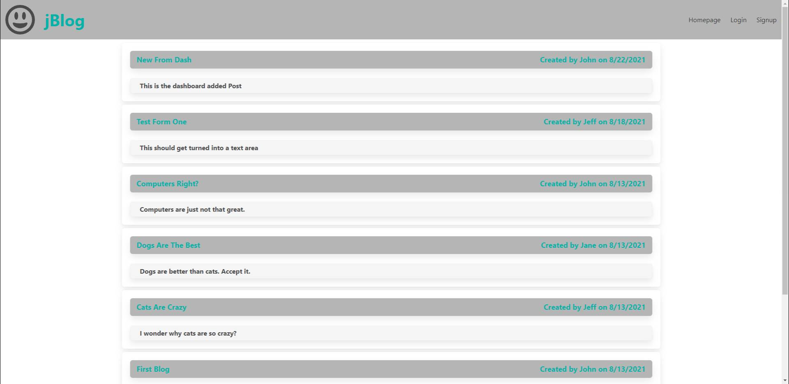

# 14-MVC-02-Homework

## Description

Jeff Severson Week 14 Homework Blog

## Table of Contents

- [Description](#description)
- [Usage](#usage)
- [Credits](#credits)
- [License](#license)

## Installation

npm i

## Usage

Sign up and/or Log in to add, edit and comment on blogs.

[Site Link](https://jeffseverson2001-mvc-homework.herokuapp.com/)

## Credits

University of Minnesota Boot Camp:
https://umn.bootcampcontent.com/University-of-Minnesota-Boot-Camp

## License

## Questions

- For additional help or questions about collaboration, please reach out to jeff@jefflizseverson.com

- Follow me on Github at [https://github.com/jeffseverson2001](http://github.com/jeffseverson2001)
